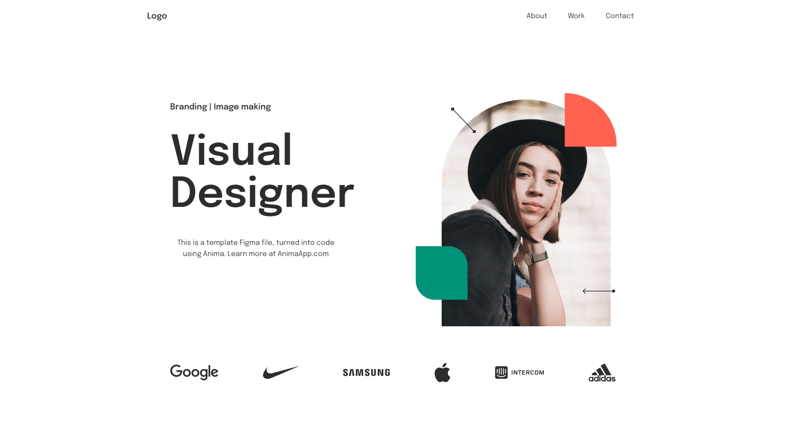

# portfolio_project_1 ⚡️

## My firts web project

<h2>
  
  <br>
</h2>

## Features

⚡️ Modern UI Design\
⚡️ Use modern bundler, Webpack 5\
⚡️ Styled with CSS preprocessor, SASS/SCSS\
⚡️ Fully Responsive\
⚡️ Auto Image, HTML and SCSS/SASS optimized using bundler

To view a site, [click here](https://1sayd.github.io/portfolio_project_1/)

## How To Bundle Your Own 🔧

From your command line, first clone portfolio_project_1:

```bash
# Clone this repository
$ git clone https://github.com/1Sayd/portfolio_project_1.git

# Go into the repository
$ cd portfolio_project_1

# Remove current origin repository
$ git remote remove origin
```

Then you can install the dependencies using NPM

```bash
# Install dependencies
$ npm install

# Start development server
$ npm run dev
```